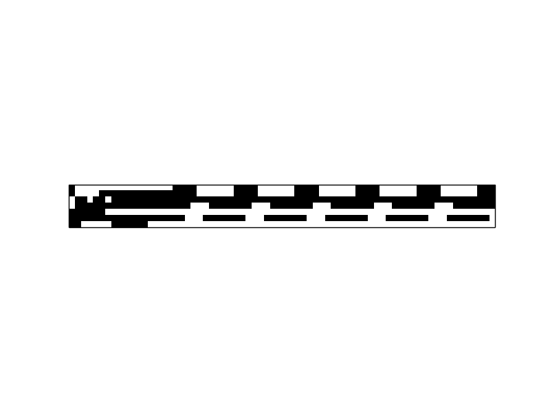

jdybm is a Java (c) implementation for learning time-series with a DyBM.  See `../../Readme.md` for information about the DyBM library.

jdybm has been used to generate all of the experimental results in Osogami and Otsuka (2015).  The following instruction provides ways to reproduce the results in Osogami and Otsuka (2015).  We find, however, that the results depend on particular JDK or particular version of the Apache Commons Mathematics Library.  In particular, OpenJDK can give error messages that are not given by IBM SDK.  For this reason, the code is modified from the original version in a way that it allows the experiment to terminate after a varying number of iterations.  This does not mean, however, that the experiments are guaranteed to terminate for all environments.

In a DyBM, a pre-synaptic neuron is connected to a post-synaptic neuron via a FIFO queue.  In the experiments of Osogami and Otsuka (2015), two neurons that are connected via a FIFO queue of length 0 were actually disconnected.  In this version of jdybm, you can connect those neurons by setting
```
private boolean CONNECT_ZERO = true;
```
in `src/com/ibm/stdp/FIFO.java`.

[Osogami and Otsuka (2015)] Osogami, T. and Otsuka, M. Seven neurons memorizing sequences of alphabetical images via spike-timing dependent plasticity. Sci. Rep. 5, 14149; doi: 10.1038/srep14149 (2015).  `http://www.nature.com/articles/srep14149`


## Prerequisites for jdybm

The main engine of jdybm is written in Java 8 and tools to draw figures are written in Python 2.7.  The main engine can be built with `ant` and relies on The Apache Commons Mathematics Library (version 3.4.1 or newer).  Install these dependencies, and make sure that `ant`, `javac`, and `java` are in the path and that the jar file of the Apache Commons Math Library is under `lib`.  For example, OpenJDK, ant, and commons-math3-3.6.1 can be installed by
```
sudo apt-get install default-jdk ant
wget http://ftp.tsukuba.wide.ad.jp/software/apache//commons/math/source/commons-math3-3.6.1-src.tar.gz
tar -xvf commons-math3-3.6.1-src.tar.gz
cd commons-math3-3.6.1
ant
mv target/commons-math-3.6.jar ../lib/
cd lib
ln -s commons-math-3.6.jar commons-math.jar
cd ../..
```
The above and the following commands should be executed on the directory where this readme is found.

The tools for figures use `networkx` and `matplotlib`, which can be installed by
```
sudo pip install networkx matplotlib
```


## Reproducing the experimental results in Osogami and Otsuka (2015)

Build the project by typing
```
ant
```

We have four sets of experiments, and these can be run by typing
```
run.bat 1
run.bat 2
run.bat 3
run.bat 4
```
for Windows and
```
./run.sh 1
./run.sh 2
./run.sh 3
./run.sh 4
```
for Linux.

Experiment 2 takes a few hours or longer before completing all of the experiments.  We also find that the results can depend on particular versions of Java, the Apache Commons Mathematics library, or other environmental settings.  In particular, Experiment 2 may not successfully complete with OpenJDK.

You can find the figures under `python/fig`.  Because the results depend on particular environment, your figures might look different from the ones in Osogami and Otsuka (2015).


## Extended results

The following animation and video are created based on the results from the above experiments (source code for creating them is not provided in jdybm).

This animation shows how the sequence having the lowest energy evolves while learning the sequence "SCIENCE":


This animation shows how the sequence having the lowest energy evolves while learning the sequence of human evolution:


This video shows how the music having the lowest energy evolve while learning Ich bin ein Musikante.
[](https://www.youtube.com/watch?v=vCcR3ii9FkA)

((C) Copyright IBM Corp. 2015)
